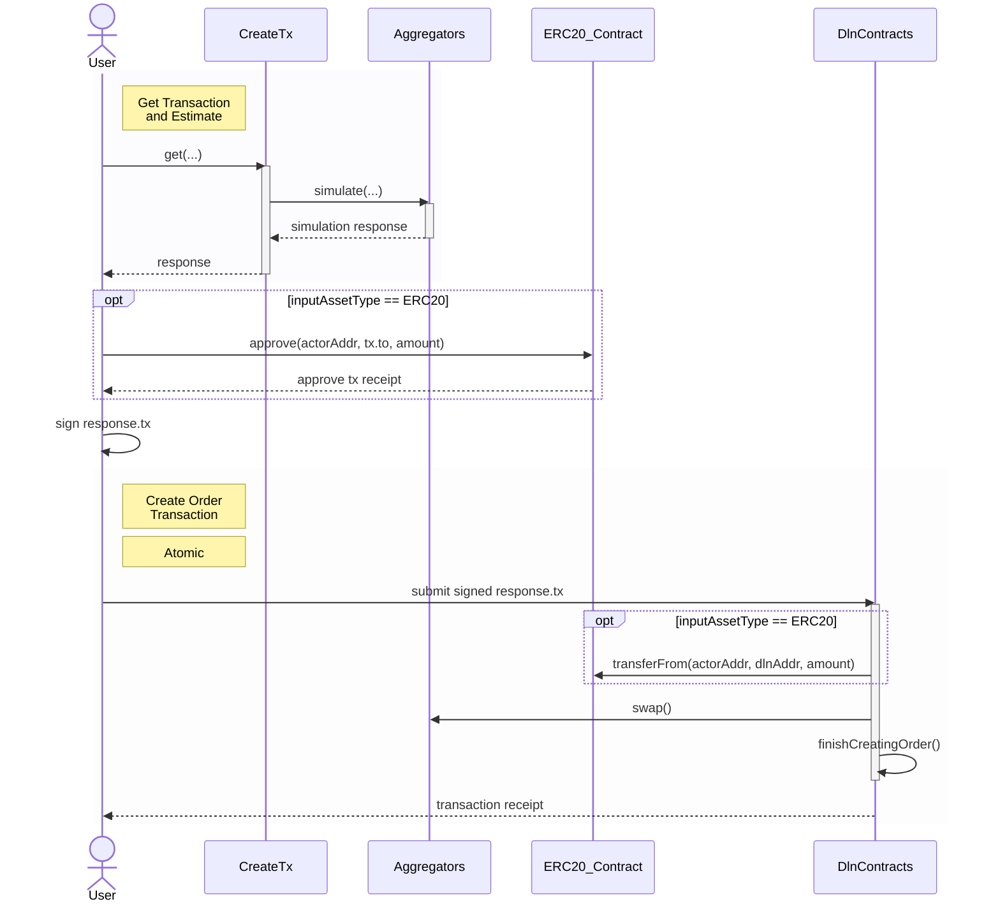

The [DeBridge Liquidity Network (DLN)](dln-dropdown/overview/introduction) protocol supports bridging any liquid token from the source 
chain to the destination chain,  not just [reserve assets](dln-dropdown/dln-specifics/reserve-assets). While the actions taken by the system are similar to those used 
when [bridging reserve assets](dln-dropdown/dln-specifics/bridging-reserve-assets), the internal flow differs and introduces considerations 
that must be communicated clearly for a seamless end-user experience.

Cross-chain settlements are executed in [reserve assets](dln-dropdown/dln-specifics/reserve-assets) to simplify operations for solvers. 
As a result, whenever a non-reserve asset is bridged, it must first be swapped into a reserve asset before the order is 
created—a process referred to as the **Pre-Order-Swap**.

The `create-tx` API automatically handles this swap step. It queries DeFi aggregators in the background to simulate the swap 
and produce `response.tx.calldata` (see step 1a in the diagram). The API is optimized to select the best available rate.

Once a user signs and submits `response.tx`, the DLN smart contracts initiate the process by transferring the approved 
non-reserve assets to themselves (step 3a). The actual **Pre-Order-Swap** is executed via an Automated Market Maker (AMM) 
(step 3b). Given the potential for price slippage, **the destination chain estimate is based on the minimum amount a user 
would receive from the swap**.

<Tip>
  If integrators prefer to manage the swap path manually, they can perform the conversion to [reserve assets](dln-dropdown/dln-specifics/reserve-assets) 
  themselves before calling the `create-tx` endpoint -- ensuring complete control over the swap route.
</Tip>

This design—basing estimates on the minimum outcome of the **Pre-Order-Swap** -- helps shield users from market volatility and 
reduces the likelihood of orders being ignored due to insufficient profitability from a solver's perspective.

Once the swap completes, the [reserve assets](dln-dropdown/dln-specifics/reserve-assets) are locked within the protocol until the order 
is either [fulfilled]() or [cancelled](). 

<Tip>
  If the order is [cancelled](), the locked [reserve assets](dln-dropdown/dln-specifics/reserve-assets) are returned to the user. 
  It is important to note that the user will receive reserve assets back -- not the original non-reserve assets used at the start of the process.
</Tip>