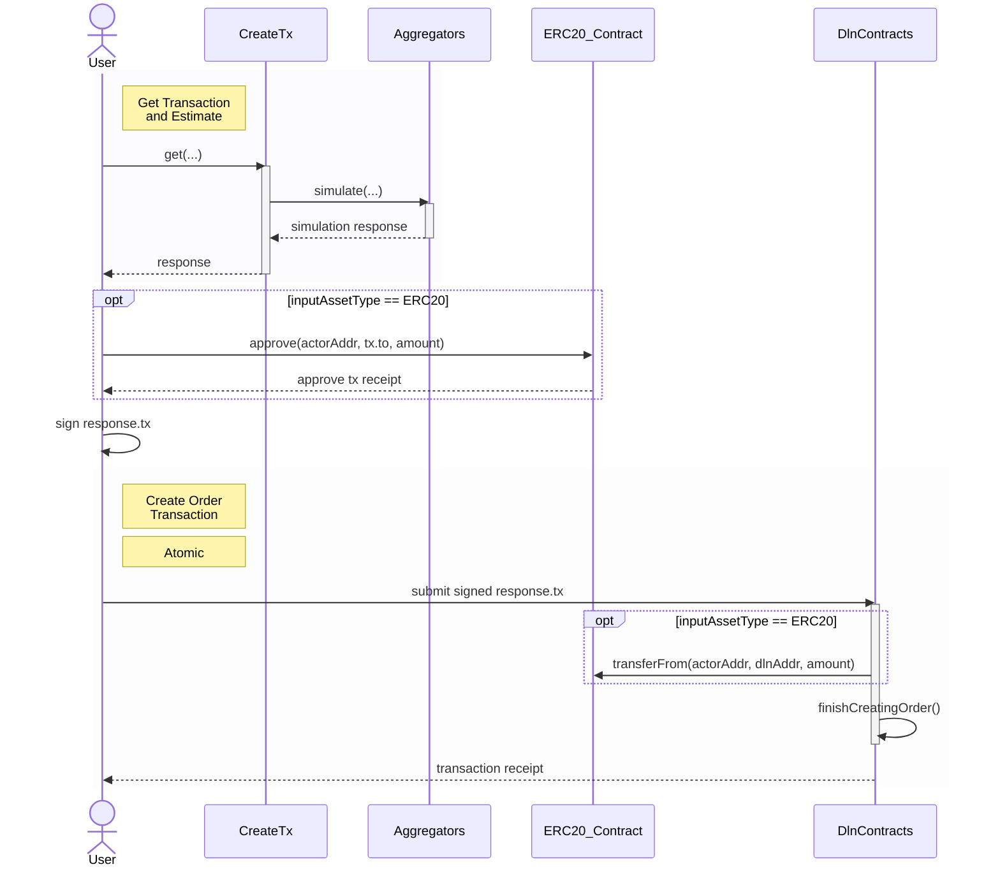

This page outlines the behavior of input assets during order creation and provides a visual representation of the process for creating 
an order using reserve assets.

When interacting with the `create-tx` API, the [response]() includes a `tx` field. To create an order, it is sufficient to sign the 
transaction and submit it to the network. The `data` field within `tx` contains all necessary instructions for creating an order 
on the source chain.

The simplest scenario occurs when bridging [reserve assets](/dln-specifics/reserve-assets) from the source chain to the destination chain. 
In this case, the order creation process on the initiator’s side consists of three distinct steps:
- Step 1: Call `create-tx` API with the required [parameters]().
- Step 2: After receiving the [response](), call `approve` on the ERC-20 contract of the [reserve assets](/dln-specifics/reserve-assets). 
The spender should be set to `response.tx.to` value, and the approved amount should match the value specified in the transaction, with [caveats]().
  + Note: This step is required only for ERC-20 assets.
- Step 3: Sign response.tx and submit the transaction. This action locks the specified amount of [reserve assets](/dln-specifics/reserve-assets) 
on the source chain until the order is either [claimed by a solver]() or [cancelled by an authorized entity]().

Once these steps are completed, the bridging process from the user's perspective is finished. The next actions involve either 
[monitoring the order’s status]() or [initiating cancellation](). Additional details on how solvers fulfill the order on the destination 
chain are available [here](/dln-specifics/order-fulfillment/order-fulfillment).