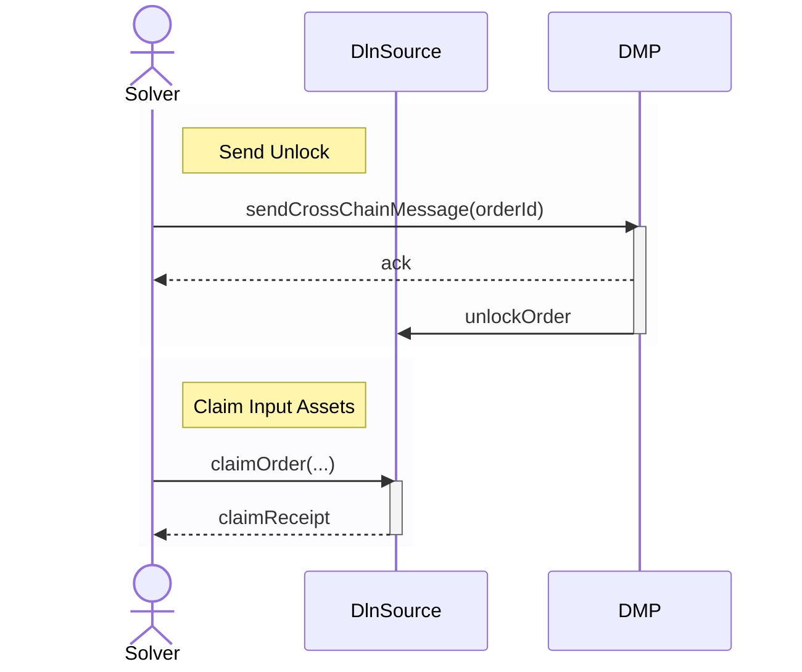

Each `orderId` is deterministic and uniquely identifies an order. To successfully fulfill the order, the solver must use the same parameters 
that were specified when the order was originally created. After successful fulfillment, the solver creates another transaction to trigger 
a cross-chain message via the DeBridge Messaging Protocol (DMP) to the source chain changing the [order state](integration-guidelines/api/monitoring-orders/order-states) 
to `SentUnlock`. This message unlocks the input reserve assets, allowing the solver to claim them.

If any parameters, such as the token amount or beneficiary, differ from the original order, the resulting `orderId` will not match. In such cases, 
the solver’s deposit cannot be matched to a valid order on the source chain, rendering the fulfillment ineffective and ensuring the input funds 
remain locked and secure on the source chain.

To finalize the process, the solver calls the `DlnSource.claimUnlock(...)` method on the source chain. This updates the order status to 
`ClaimedUnlock`, and the initially locked order input reserve assets are transferred to the solver. At this point, the order is considered 
claimed and fulfilled and its state is `ClaimedUnlock`. Affiliate fees are also automatically paid out on EVM chains, and they are ready 
for withdrawal on Solana. 