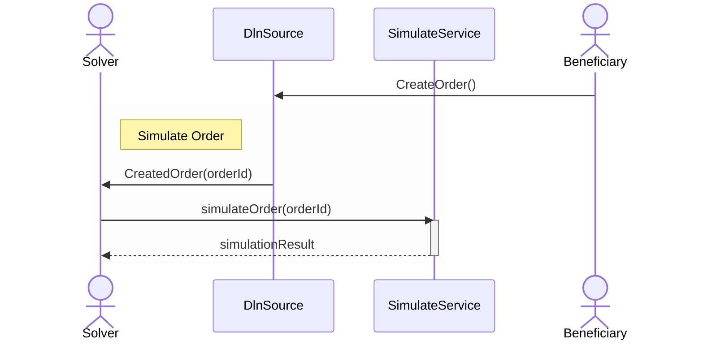

The sequence diagram below demonstrates how the fulfillment process begins. After a beneficiary successfully creates an order in 
`DlnSource` smart contract, a solver will be listening to emitted events. 



Solvers will detect the `CreatedOrder` event:

```solidity
event CreatedOrder(
    Order order,
    bytes32 orderId,
    bytes affiliateFee,
    uint256 nativeFixFee,
    uint256 percentFee,
    uint32 referralCode
);
```

This event emits an `Order` struct, which provides the information necessary to either fulfill or cancel the order. 
Further details about the Order structure can be found here.

Solvers evaluate whether an order is worth fulfilling based on its profitability, which they simulate on their infrastructure. 
To ensure orders are attractive to solvers, integrators must configure them so that the spread between input assets and wanted 
assets covers all associated costs, including operating expenses and all of the fees. Additional considerations around profitability 
are discussed in the following section.

Solvers typically begin by simulating the order to evaluate its profitability. Unprofitable orders are ignored. However, if market conditions 
change, solvers may re-simulate previously ignored orders to reassess their viability.