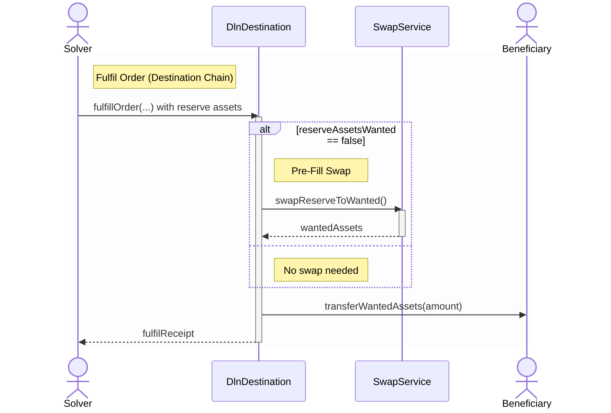

After the `OrderCreated` event is detected, and solvers deem the order profitable, they enter the next stage of the process, illustrated by the green background in the diagram below.

```mermaid
sequenceDiagram
    actor Solver
    participant DlnDestination
    participant SwapService
    actor Beneficiary
    
        rect rgba(240, 240, 240, .15)
            note right of Solver: Fulfil Order (Destination Chain)
            Solver ->> DlnDestination : fulfillOrder(...) with reserve assets
            activate DlnDestination
            alt reserveAssetsWanted == false
                note right of DlnDestination: Pre-Fill Swap
                DlnDestination ->> SwapService : swapReserveToWanted()
                activate SwapService
                SwapService -->> DlnDestination : wantedAssets
                deactivate SwapService
            else
                note right of DlnDestination: No swap needed
            end
            DlnDestination ->> Beneficiary : transferWantedAssets(amount)
            DlnDestination -->> Solver     : fulfilReceipt
            deactivate DlnDestination
        end
```