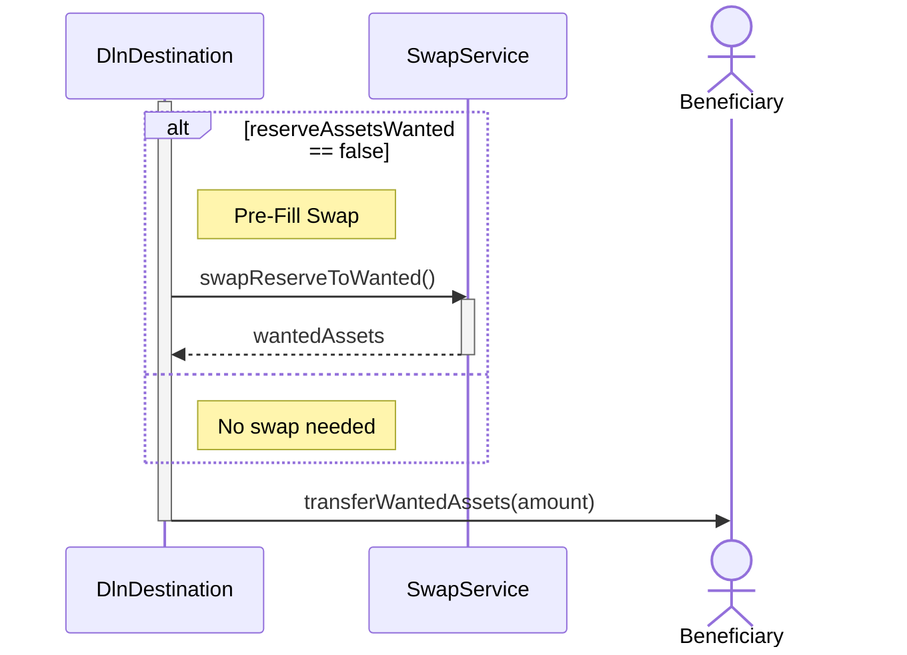

Sint ullamco amet deserunt consectetur culpa mollit tempor eu magna consequat. Amet enim commodo sint sunt ullamco tempor id. Sunt ut sit deserunt aute ea pariatur proident sint. Quis veniam reprehenderit qui ullamco dolore sint sit eiusmod do ea.

Ut excepteur sint voluptate sunt sit laboris elit pariatur ea incididunt nisi adipisicing qui. Labore adipisicing commodo irure officia qui pariatur elit consectetur magna exercitation. Officia ex sint commodo veniam incididunt. Velit magna sint reprehenderit veniam dolor ullamco fugiat eu aliquip esse adipisicing anim. Nostrud pariatur mollit ea ex ut consequat dolore id laboris adipisicing aliquip ut. Qui proident anim deserunt elit laborum in mollit elit dolor elit.

Cillum velit non id pariatur magna consequat magna pariatur nulla exercitation aliquip mollit. Qui non nulla anim ex. Velit aliqua dolore esse aute nisi. Veniam non enim deserunt quis do duis esse. Est ullamco sunt velit eiusmod nostrud do ullamco nulla deserunt magna qui officia ipsum anim. Exercitation velit qui dolor elit.

Id proident veniam minim magna. Nulla cupidatat commodo cillum occaecat est et Lorem qui. Officia ipsum ut deserunt ullamco tempor cupidatat nisi mollit. Mollit culpa tempor incididunt dolore. Aliqua ut non est laboris. Dolore adipisicing mollit nulla Lorem Lorem veniam cillum ad.

Cupidatat incididunt eiusmod culpa reprehenderit laboris quis do qui est consectetur ea. Voluptate cillum dolore velit nulla veniam do nostrud in proident eu culpa consectetur irure. Ipsum proident commodo laboris proident tempor est consequat id labore non voluptate veniam mollit. Exercitation elit pariatur ad laborum est veniam laboris anim culpa eiusmod irure. Elit deserunt consequat qui incididunt dolor laboris incididunt ex incididunt ut excepteur elit ipsum sit. Adipisicing ullamco aute adipisicing et aute sunt tempor fugiat dolore enim.

