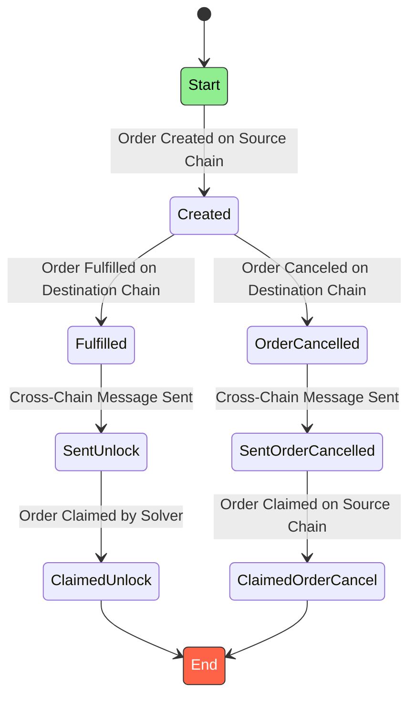

In the figure below, the order states are represented in a state-machine diagram, with the actions that trigger each state transition. 

According to the DLN API, an order must be in one of these states:

| State              | Description |
|--------------------|-------------|
| **Created**        | An order placed by a user on the DLN is pending fulfillment. |
| **Fulfilled**      | The order on the destination chain has been completed by a solver. The full amount of the requested assets has been successfully transferred to the `dstChainTokenOutRecipient`. |
| **SentUnlock**     | After fulfilling the order, the solver initiates the unlock procedure on the destination chain. A cross-chain message is sent via DMP to unlock the input assets locked on the source chain. |
| **ClaimedUnlock**  | The unlock process is finalized, and the solver receives the input assets. The affiliate fee is directed to the `affiliateFeeRecipient` on the source chain. |
| **OrderCancelled** | The `dstChainOrderAuthorityAddress` has started the cancellation process on the destination chain. |
| **SentOrderCancel**| A cross-chain message is sent via DMP from the destination to the source chain. It unlocks the input assets on the source chain to be claimed by the `srcAllowedCancelBeneficiary`. |
| **ClaimedOrderCancel** | The source chain input assets have been claimed by the `srcAllowedCancelBeneficiary`. The cancel procedure is finalized. |
